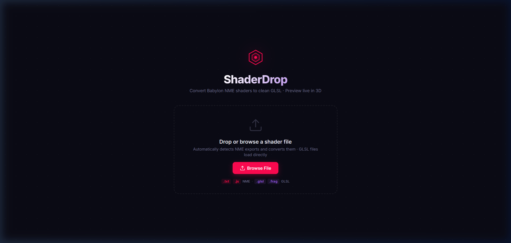

# Babylon NME to Phaser Shader Converter

A powerful, browser-based tool that effortlessly converts shaders created in the [Babylon.js Node Material Editor (NME)](https://nme.babylonjs.com/) into production-ready GLSL fragment shaders for use in **Phaser 3** (or any custom WebGL pipeline).



## Features

- ✨ **Drag & Drop Interface:** Instantly drop your NME exports to see them converted and rendered live.
- 🔄 **Universal Format Support:** Convert from three different NME export formats:
  - **NME JSON Export** (`.json` save files)
  - **NME Block Graph** (`.js` snippet exports)
  - **Compiled NME GLSL** (Raw vertex/fragment shader exports)
- 🧱 **Massive Block Support:** Supports over 50+ NME blocks including vectors, math, trigonometry, waves, logic, and gradients.
- 🎲 **Native Noise Support:** Fully inline GLSL implementations for NME's `SimplexPerlin3D` and `VoronoiNoise` blocks. No external dependencies required!
- 🛠️ **Live WebGL Preview:** Inspect your converted shader immediately on a 3D mesh with interactive camera controls.
- 💾 **One-Click Save:** Download the flawlessly converted GLSL file, ready to drop into your Phaser game engine.
- 🐞 **Smart Error Handling:** Provides robust type inference and toast notifications detailing exactly which unsupported blocks were found (if any).

## How to Use

1. Build your masterpiece in the [Babylon Node Material Editor](https://nme.babylonjs.com/).
2. Export your material. You can use:
   - **Save** (creates a `.json` file)
   - **Generate Code** (creates a `.js` snippet)
3. Drag and drop the exported file into this tool.
4. Preview the rendering results live.
5. Click **Save Converted GLSL** to download your Phaser-compatible fragment shader.

## Supported NME Blocks

The converter intelligently reconstructs the Babylon block graph into a flat procedural GLSL script. Supported blocks include:

* **Math Built-ins:** `Add`, `Subtract`, `Multiply`, `Divide`, `Mod`, `Max`, `Min`, `Abs`, `Sign`, `Floor`, `Ceiling`, `Round`, `Fract`
* **Trigonometry:** `Sin`, `Cos`, `Tan`, `ArcSin`, `ArcCos`, `ArcTan`, `ArcTan2`, `DegreesToRadians`, `RadiansToDegrees`
* **Vectors & Matrices:** `Dot`, `Cross`, `Length`, `Distance`, `Normalize`, `Reflect`, `Rotate2d`, `Transform`
* **Signals & Waves:** `SawToothWave`, `SquareWave`, `TriangleWave`, `SimplexPerlin3D`, `VoronoiNoise`, `RandomNumber`
* **Interpolation & Remap:** `Lerp`, `NLerp`, `SmoothStep`, `Step`, `Clamp`, `Remap`
* **Structure:** `VectorSplitter`, `VectorMerger`, `ColorSplitter`, `ColorMerger`, `Elbow`
* **Rendering:** `Texture`, `ImageSource`, `Gradient`, `Posterize`, `Desaturate`, `ReplaceColor`, `Fresnel`, `FrontFacing`, `Discard`, `FragmentOutput`

## Running Locally

To run the converter locally, ensure you have [Node.js](https://nodejs.org/) installed, then:

```bash
# Install dependencies
npm install

# Start the Vite development server
npm run dev
```

Visit the provided `localhost` URL in your browser to start converting!

## Using the Output in Phaser

Your downloaded `.glsl` file can be used directly in Phaser 3 as a custom pipeline or `Phaser.Display.BaseShader`.

```javascript
// Load the generated GLSL
this.load.glsl('myShader', 'path/to/converted.glsl');

// Use it in your game
const shader = this.add.shader('myShader', 400, 300, 800, 600);
```

## License
MIT License
